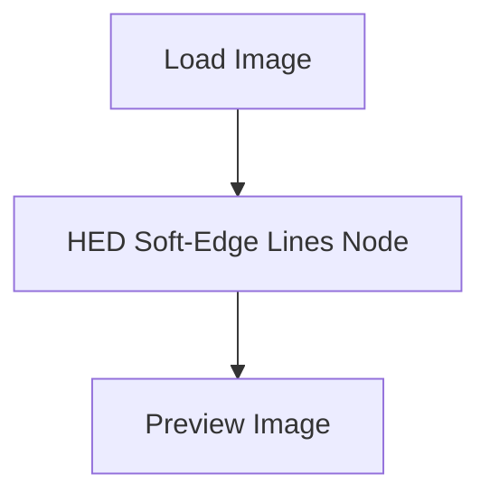
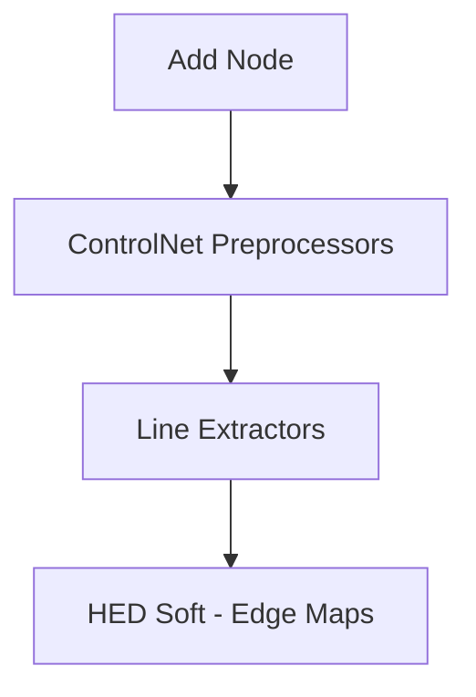
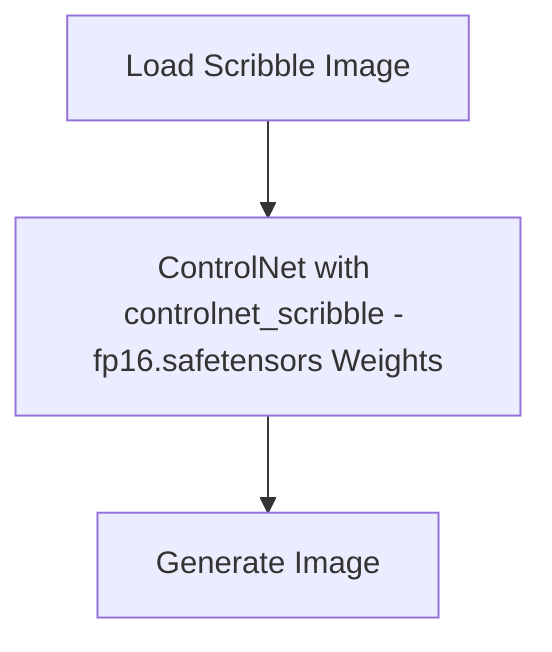

# COMP7065 Innovative Laboratory
## Spatial Control with ControlNet
After completion of this lab, students will be able to
1. Construct workflows with ControlNet nodes;
2. Apply various spatial control to output image by ControlNet, including:
    - a) Human Pose,
    - b) CannyEdge Maps,
    - c) M-LSD Line Maps,
    - d) HED Boundary Maps,
    - e) Scribbles;
3. Integrate spatial control to their AI artworks;

### Table of Contents
1. Pose control with ControlNet ................................................................................. 2 
2. Explore different types of spatial control ............................................................... 9 
3. Exercise ................................................................................................................. 15
Credit to SHANG Sifeng

### 1. Pose control with ControlNet
Preparations: In this part, you will learn how to build a basic workflow that applies human pose control through ControlNet and OpenPose. Before we build up the workflow, you should download the model weights of ControlNet first. It is recommended to download the pruned versions on HuggingFace through the following link:
https://huggingface.co/webui/ControlNet-modules-safetensors/tree/main

webui Contro1Net-modules-safetensors ie .43
I Files and wrsion
History. 10commits +Contribute 
=ClashSAN Uplead2 almost 2 years ago
itatributes almost 2 years ago
READNEmd almost 2 years ago
cidm_v15yaml esa almost 2 years ago
cldm_v21yamleSae almost 2 years ago
control_canny fpl6.safeensors A 8 almost 2 years apo
controldepth-fp16safetensors almost 2 years agpo
conrolhed-p16afetensors8 721 0 1B5 almost 2 years ap
conrolmisd-fp16.saieensors 8 723M U5 almost 2 years agpo
control_norma- fp16.saletemsors 723B U5 Uleed9 files almost 2 years agpo
control oepoe fp.salenons Uplood 9 files almost 2 years ap
control_xrible fp16.satetemsors n almost 2 years ago
conrol_weg fp16.saletemsors n0 ed9files almost 2 years agpo
t2ladapter_canyp16saletensos es 
t2dapter_cor p1.satesos ss almost 2 years ago
t2dapte_depth fp1sareon s 
t2ladapter_keypose fp16.aletesorsSal 8
t2ladapter_operpose fp16.saetensorsS 8 almost 2 years apo
t2udapte.g 16.saiteon almost 2 years agp
t2idper_kechp16 saonss eed3 files almost 2 years ago
t2idapter_style fp16.saltimson almost 2 years ap

Please download the weights named ‘control_canny-fp16.safetensors’, ‘control_hedfp16.safetensors’, ’control_mlsd-fp16.safetensors’, ’control_openpose-fp16.safetensors’ and ‘control_scribble-fp16.safetensors’, and place all of them into this folder: ‘ComfyUI\models\controlnet’. Note that the postfix of the filename specifies the usage of the weights. For example, ‘_scribbles’ means that the ControlNet is trained to recognize spatial control from a scribble.
Credit to SHANG Sifeng

Alternatively, you can download the full model weights of ControlNet from its developer’s model repository on HuggingFace:
https://huggingface.co/lllyasviel/ControlNet/tree/main/models

lyasviel Contro1Net b le 3.63
cotrold15_hed pth
cotsl_dis. pepue ph
cotbol_sdis_sbe ch s p
cotedlsd5_seg.pth e

However, the full model weights occupy a considerable amount of disk storage (5.71GB for each type), and may potentially cause ‘Cuda: out of memory’ error during generation process. Meanwhile based on my own experience, the output quality doesn’t have a significant improvement when replacing the pruned ControlNet with the full weights one. So it is more recommended that you directly use the pruned version of ControlNet.

Secondly, please install the custom node ‘comfyUI_controlnet_aux’ by using ComfyUI node manager. This custom node provides you with a convenient method to apply image preprocessing, such as pose estimation and straight line detection, so as to cooperate with ControlNet spatial control.

Filter Al Qcomfyui controlnet aux x 2 custom nodes
ID Title Version Action Description Extensi... Conflicts
Try update
comfyui_controlnet aux 1.0.5 Switch Ver Disable Paandlay camjtl ee
Uninstall
Credit to SHANG Sifeng

[Optional] During testing the showcases on our Lab’s computer, I found that this custom node may not work smoothly in the latest ComfyUI. It sometimes may fail to automatically download the required model weights of the preprocessing network. To avoid this issue, you may need to manually download these weights from their official HuggingFace website by yourself, and place them into the folder:
‘ComfyUI\custom_nodes\comfyui_controlnet_aux\ckpts\lllyasviel\Annotators’.

Son =Vew ….
11/12/2024700pm File fokfe
11/12/2024700pm PTH Fle 204363K3
11/12/20047:00pm PTH Fie 150,117KB
11/12/2024 7:00 pm PTHFie 143,888 B
11/12/20247:31pm PIHFle
11/2/20247.31 -m

The required model weights for this lecture’s showcases are marked in the figure below.
History: 16 commits
Ted over l year agp
over I year agp
owr I year ago
over I yer ago
over yar agp
Over I yer agp
over yer agp
over lyeragp
ovr yar ago
y pose_n node over 1 year agp
over yr gp
over I year ago
ove yer agp
over l year agp
over yar g
lama.ckpt over 1 year ago
ed 2f11es over l yer agp
mad_larg.52p2 pth Up1od 7 f1es over yar agp
over I year ago
network-bsds500 pth5ae Uplead7files ove year agp
Uplod2 fsies over l yer ap
over year agp
over 1 year app
Ovr 1 year agpo
over l year agp
upemet_glbal_smallpthSp owr 1 year aga
Credit to SHANG Sifeng

Showcase: Human pose control is a basic function of ControlNet. Below is a showcase workflow adapted from an official example provided by RunComfy. You can download the source image (human.png) from this link.

Basically, this workflow in the showcase is equivalent to adding two additional groups of nodes to the default image-to-text workflow. The first group of nodes is responsible for image preprocessing, while the other group configures the ControlNet.
Image Preprocessing: In this showcase, the image preprocessing is to detect the keypoints of the human body such as face and joints using the OpenPose network. You should pay attention to the ‘OpenPose Pose’ node, which is the core during image preprocessing. You can add it into your workflow by left clicking your mouse first and sequentially select ‘Add Node -> ControlNet Preprocessors -> Faces and Poses Estimators -> OpenPose Pose’.
(AP10K
Credit to SHANG Sifeng

The functionality of this node is to apply pose estimation of a given figure photo or drawing. As illustrated by the Preview Image node, the output image consists of keypoints of the figure, and the keypoint image is then fed to ControlNet to apply spatial control to stable diffusion models. Description of each setting of the ‘OpenPose Pose’ node are presented in the table below. You may also refer to this link for more detailed explanations.

| Setting | Description |
| --- | --- |
| detect\_hand | When enabled, the OpenPose Pose node will detect keypoints of hands. |
| detect\_body | When enabled, the OpenPose Pose node will detect keypoints of body parts. |
| detect\_face | When enabled, the OpenPose Pose node will detect keypoints on the faces. |
| resolution | This parameter determines the size of keypoint image, which will always be in a square shape. It doesn’t affect the resolution of the final output. |
| scale\_stick\_for\_xinsr\_cn | When enabled, the body lines will be plotted thicker and the result becomes more stable. See this post for more details: https://github.com/Fannovel16/comfyui\_controln et\_aux/issues/447 |

Prepreprocess
●Load Image IMAGE #39 ●OpenPose Pose #43 comfyui_controlnet_aux Preview Image
MASK
human.png
choose fle to upload
512
disable
Credit to SHANG Sifeng

ControlNet
#41
Load ControlNet Model
CONTROL NET
control net name control openpose-fp16.safeten...
#42
Apply ControlNet
positive positive
negative negative
control net
image
vae
strength 1.00
start_percent 0.000
end_percent 1.000

Configuring the ControlNet: The other group of nodes, including ‘Load ControlNet Model’ and ‘Apply ControlNet’, are responsible for configuring the ControlNet model. The functionality of ‘Load ControlNet Model’ is easy to understand. It just loads the weights of a ControlNet model that you’ve downloaded during the preparation stage. Note that you should match the model weights with the type of spatial prompts. For exmample, in this showcase we utilize the keypoint image estimated by OpenPose as the prompt image for ControlNet, so the corresponding weights should be ‘control_openpose-fp16.safetensors’. One may not set the weights other than that, such as ‘control_scribble_fp16.safetensors’, which is intended for applying spatial prompts by scribbles. You may add the ‘Load ControlNet Model’ node by sequentially selecting ‘Add Node -> loaders -> Load ControlNet Model’, or just type its name in the search bar popped after double clicking on the workspace.

Add Group Add Node Convert to Group Node >utils loaders sampling video_models Load Checkpint Load VAE
Manage Group Nodes Add Group For Selected Nodes latent conditioning Load LoRA Load ControlNet Model
Save Seleced as Template Node Templates image mask for_testing Load CLIP Vision Load ControlNet Model (diff)y Load Style Model
advanced unCLIPCheckpointLoader
model_patches GLIGENLoader
audio LoraLoaderModelOnly
ControlNet Preprocessors Hypernetworkloader
api Load Upscale Model

The ‘Apply ControlNet’ node configures the ControlNet previously loaded by ‘Load ControlNet Model’ node. The description of each setting is presented in the table below. You can refer to this link for a detailed description on ComfyUI wiki.

| Setting | Description |
| --- | --- |
| postivie | Positive conditioning features, such as the output of a positive CLIP text encoder. |
| negative | Negative conditioning features, such as the output of a negative CLIP text encoder. |
| contrl\_net | The ControlNet model weights previously loaded |
| image | The preprocessed image for spatial constraint. |
| vae | Optional, determines whether ControlNet should affect the VAE models. |
| strength | A scalar that determines the strength of ControlNet’s effect on conditioning features. |
| start\_percent | A float number between 0 and 1 that controls the start point of ControlNet’s effect during denoising steps. |
| end\_percent | A float number between 0 and 1 that controls the end point of ControlNet’s effect during denoising steps. |

It could be observed from the output image that the ControlNet is very effective. We didn’t describe anything about pose in our text prompt. But in the result, the man actually shares a very similar posture as the one in input.
You are strongly encouraged to rebuild this showcase workflow on your own as an exercise. Also try to adjust different settings and observe the impact on output images. This helps you to strengthen the understanding of the functionalities ControlNet model in an intuitive manner.
Credit to SHANG Sifeng

### 2. Explore different types of spatial control
Part 2 is just a simple showcase of how to apply spatial control of human pose through ControlNet. In Part 3, we will explore more types of spatial control by providing the ControlNet with different kinds of spatial prompts. Showcases in part 3 cover spatial prompts of Canny edge maps, Hough line maps, HED boundary maps and scibbles. It's also noteworthy that workflows in Part 3 are highly similar to the one in Part 2. The key differences lie in the preprocessing node and the corresponding model weights of ControlNet. They are adjusted according to the type of spatial prompts. Source images used in these showcases can be accessed through this link on Github.
#### Canny edge maps
Below is a showcase workflow that uses a Canny edge map as spatial prompt for ControlNet. The Canny edge detection method is a classical approach in image processing. It detects the edges of a given image using convolutional operations with Canny operator. The Canny operator assigns each pixel with its gradient, and the absolute value of it is used to judge whether the pixel is an edge. The final output of Canny edge map is a binary image where the edges are highlighted, as shown in the figures below.

Credit to SHANG Sifeng

Preprocess
#39 #61
Load Image #62 comfyui controlnet aux Preview Image
IMAGE Canny Edge
MASKO IMAGE
dog.png ow_threshold 100
choose file to upload high threshold 200
resolution 512

To apply Canny edge detection, you should modify the preprocess step by replacing ‘OpenPose Pose’ node with the ‘Canny Edge’ node, and set the model weights of ControlNet to ‘control_canny-fp16.safetensors’. You can find the node by clicking ‘Add Node -> ControlNet Preprocessors -> Line Extractors -> Canny Edge’.
> Anine Lineat

The settings of ‘Canny Edge’ node adjust the hyperparameter of the Canny edge detection algorithm. The description of each settings is presented in the table below. You can refer to this link for a more detailed explanation.

| Setting | Description |
| --- | --- |
| low\_threshold | An integer ranges from 0 to 255. Edge pixels whose gradient value is lower than this bound will be discarded. Descreasing this value result in more edge pixels. |
| high\_threshold | An integer ranges from 0 to 255. Edge pixels whose gradient value is higher than this bound will be definitely preserved. Increasing this value result in less edge pixels. |
| resolution | This parameter determines the size of edge map, which will always be in a squared shape. It doesn’t affect the resolution of the final output. |

Credit to SHANG Sifeng
#### M-LSD line maps
M-LSD stands for mobile line segment detection. It is a deep learning-based, end-to-end line detection approach. In M-LSD, a light-weighted nerual network model detects the straight line segments inside an image, and returns a binary image in which the estimated line segments are highlighted, as shown in the figures below. It’s notable that M-LSD line maps are very powerful for scene designs because the output image maintains almost the same structures as the spatial prompt image. You can refer to the original paper for more details about M-LSD method.
1 ×0

Preprocess
#39 #61
Load Image #63 comfyui_controlnet aux Preview Image
room.png IMAGE MASK● image M-LSD Lines IMAGE
choose file to upload dist threshold core threshold 0.10 0.10
resolution 512
Credit to SHANG Sifeng

To apply M-LSD method, you should use the ‘M-LSD Lines’ in preprocess stage, and change the weights of ControlNet to ‘control_mlsd-fp16.safetensors’. The figure below shows how to find the node, and the table below explains the settings of it. You can read the descriptions provided by this link for more details.
Add Group Ad Node utils sampling Line Extractors Semantic Segmentation AnyLine ineart Binary Lines
Corvert to Group Node loaders T2IAdapter-only Canny Edge
Manage Group Nodes conditioning Faces and Foses Estmators Difusion Edge (batch size t=>speed , VRAM +)
Add Group For Selected Nodes latent Normal and Depth Estimator HED Soft-Edge Lines
Save Selected as Template image others Fake Scribble Lines (aka scribble hed)
Node Templates mask Pose Keypoint Postprocess Realistic Lineart
advanced for_testing Recolor tile Anime Lineart Standard Lincart
model_patches audio Optical Flow AIO Aux Preprocessor Manga Lineart (aka lineart_anime_denaise) M-LSD Lines
ControlNet Preprocessors Preprocessor Selector PIDINet Sof- Edge Lines
>Pixel Perfect Resolution PyraCanry
Generation Resolutin From Image Generation Resolutin From Latent Scrble Lines Scible DG Lines
Enchance And Resize Hint Images Scribble PIDiNet Lines
ExecuteAll ContolNet Preprocessos TEEDPreprocessor ControlNeAuxSimpleAdext

| resolution of the final output. |
| --- |
| HED stands for holistically-nested edge detection. Similar to M-LSD, it is also a deep- learning based, end-to-end method. HED performs fast prediction on the edges of an given image using a fully convolutional nerual network. HED boundaries are different with the |
| Canny edges, because they are ‘soft’ edge maps instead of binary. This means that HED boundaries are more detailed. If you are

### HED boundary maps
HED stands for holistically-nested edge detection. Similar to M-LSD, it is also a deep - learning based, end-to-end method. HED performs fast prediction on the edges of a given image using a fully convolutional neural network. HED boundaries are different from the Canny edges because they are ‘soft’ edge maps instead of binary. This means that HED boundaries are more detailed. If you are interested in the technical details of this method, you can refer to its original paper on arxiv.

Preprocess:
| Step | Action |
| ---- | ---- |
| 39 | Load Image |
| 64 | comfyui_controlnet_aux Node |
| Preview Image | Display Processing Result |
| Select File to Upload | cyber.png |
| Enable Relevant Settings | - |
| Resolution | 512 |

To apply the HED method to ControlNet spatial constraint, you should use the ‘HED Soft - Edge Lines’ node in the preprocess stage and select ‘control_hed - fp16.safetensors’ as the weights for ControlNet. To find the node, you should sequentially click on ‘Add Node -> ControlNet Preprocessors -> Line Extractors -> HED Soft - Edge Maps’, as shown in the figure below. The setting ‘safe’ determines if the additional safety checks should be toggled. You can read the detailed explanation provided by this link for more instructions.

### Scribbles
The last showcase is to provide a scribble as a spatial prompt. Compared with others, this may be the simplest one since no preprocess is required, and you only need to change the model weights of ControlNet to ‘controlnet_scribble - fp16.safetensors’ and feed it with a scribble or sketch.

### 3. Exercise
Draw a scribble by yourself using the ‘Canvas Tab’ node and feed it as a spatial prompt to ControlNet. Feel free to design anything you like! If you forgot what is a ‘Canvas Tab’ node, please check Exercise (2) in Lab 7 for more details.

Final Submission: Please submit the workflow and 10 images generated from your drawings (along with the manual drawings), as a single zip file. 

